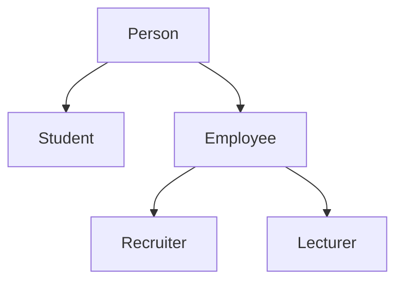

## Classes structure:

```mermaid
graph TD;  
Person-->Student;  
Person-->Employee;  
Employee-->Recruiter;  
Employee-->Lecturer;
```

Overloaded methods: work in Recruiter  
Overriden methods:
 - work in Recruiter and Lecturer
 - introduce in Student, Employee and Recruiter